Tạo package
-----------

.. note:: Hãy chắc chắn rằng bạn đã cài các mục bắt buộc mà tôi đã hướng dẫn bên trên.

Bước 1. Mở terminal -> Tạo package::
 
  cd ~/catkin_ws/src 
  catkin_create_pkg my_first_ros_pkg std_msgs roscpp 
  
Bước 2. Sửa đổi file cấu hình package: “package.xml”
 
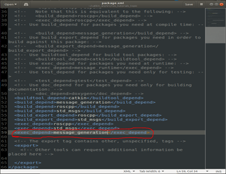
   
Mở folder “src” trong folder (ROS package) vua tao. Add source code (.cpp).
 
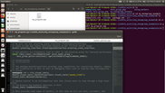
  
Bước 3. Sửa đổi file cấu hình build: “CMakeLists.txt”
          
 * find_package
 * add_executable
 * target_link_libraries

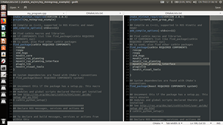
  

Bước 4. Tạo thư mục msg và file định nghĩa kiểu message

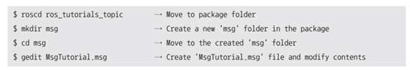
   
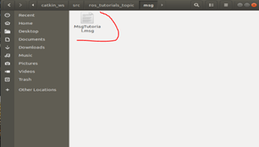
   
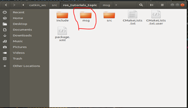

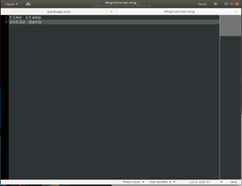
   
Bước 6. Coding publisher node \*.cpp\

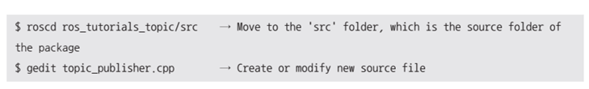

Bước 7. Coding subscriber node \*.cpp\

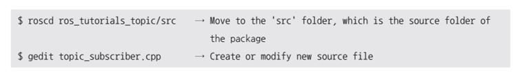
   
Bước 8. Build hệ thống::

 cd ~/catkin_ws
 catkin_make

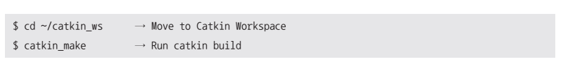
   
Bước 9. Run the publisher/ subscriber
 
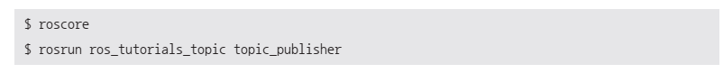

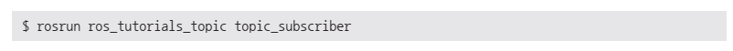
   
Bước 10. Kiểm tra và chạy thử node đã build::

 rosrun my_movegroup_example my_program
 
 