Truyền thông tin
================

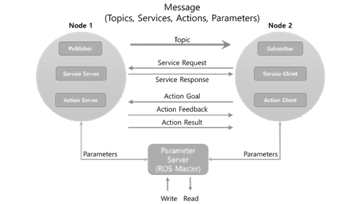

+----------+-------------+------------+--------------------------------------+
| Kiểu     |   Đặc điểm  |            |          Sự miêu tả                  |
|          |             |            |                                      |
+==========+=============+============+======================================+
| Topic    |Không đồng bộ| Một hướng  |  Sử dụng khi trao đổi dữ liệu        |       
|          |             |            |            liên tục                  |
+----------+-------------+------------+--------------------------------------+
| Service  |   Đồng bộ   | Hai hướng  | Sử dụng khi yêu cầu xử lý thông tin  |
|          |             |            |    và đáp ứng trạng thái hiện tại    |
+----------+-------------+------------+--------------------------------------+
| Action   |Không đồng bộ| Hai hướng  | Được sử dụng khi rất khó để sử dụng  |
|          |             |            |   service do thời gian đáp ứng lâu   |
+----------+-------------+------------+--------------------------------------+

Topic
-----

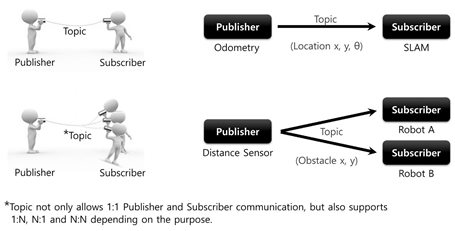
   
* Node publisher và node subscriber đăng kí message với master. Khi giống nhau chúng kết nối trực tiếp với nhau.
* Chủ đề là một chiều, duy trì kết nối gửi và nhận liên tục. 
* Nó phù hợp cho dữ liệu cảm biến.
* Nhiều thuê bao có thể nhận được thông báo từ một nhà xuất bản và ngược lại.

Service
-------

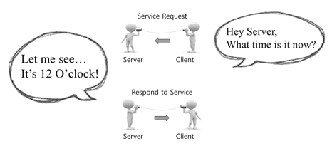
   
* Truyền thông về dịch vụ là một thông tin liên lạc đồng bộ hai chiều giữa service client yêu cầu một dịch vụ 
  và service server đáp ứng yêu cầu như trong hình trên.
* Khi yêu cầu và phản ứng của các dịch vụ được hoàn thành, kết nối giữa hai nút sẽ bị ngắt kết nối. 
* Một dịch vụ thường được sử dụng để chỉ huy một robot thực hiện một hành động hoặc nút cụ thể nhằm thực hiện các sự kiện nhất định với một điều kiện cụ thể.

Action
------

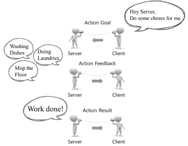
   
Máy khách yêu cầu đến máy chủ một hành động cần một thời gian dài. Máy chủ hành động và thường xuyên gửi những phản hồi về cho máy khách. 
Cuối cùng máy chủ báo nhiệm vụ thành công, máy khách tiếp nhận và ngắt kết nối.

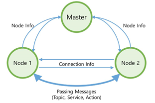
   
Ban đầu các node kết nối với master. master lưu giữ tất cả thông tin của các node. node này sẽ có được lượng thông tin tương đối của node khác thông qua master.
Sau đó mỗi node kết nối trực tiếp với nhau để thực hiện truyền thông điệp.

Parameter
---------

Message Communication Flow
--------------------------

1. chạy Master

 Master phải được chạy đầu tiên. Các master trong ROS được điều hành bằng cách sử dụng lệnh 'roscore' 
 và chạy máy chủ với XmlRpc. Các master đăng ký tên của các nút, các chủ đề, dịch vụ, hành động, các loại tin nhắn, 
 địa chỉ URI và cổng cho các kết nối node-to-node, và chuyển tiếp thông tin đến các nút khác theo yêu cầu::
  
   $roscore
  
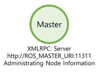

2. Chạy Node Subscriber

 Chạy node subscriber bằng lệnh  rosrun hoặc roslaunch. Node subscriber đăng kí tên node của nó, tên topic, loại message, địa chỉ URI, 
 và cổng với master khi nó chạy. Các master và node giao sử dụng XmlRpc.

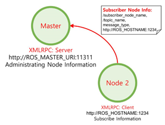

3. Chạy Node Publisher

 Để chạy node publisher chúng ta cũng sử dụng lệnh 'rosrun' hoặc 'roslaunch' như node subscriber. 
 Node publisher đăng ký tên node, tên topic, loại message, địa chỉ và cổng URI của nó với các master. 
 Các master và node giao sử dụng XmlRpc.

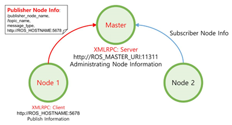

4. Cung cấp thông tin publisher cho subscriber

 Các master phân phối thông tin như tên của publisher, tên topic, loại message, địa chỉ URI và số cổng của publisher
 cho các subscriber mà muốn kết nối đến node publisher. Các master và node giao sử dụng XmlRpc.
 
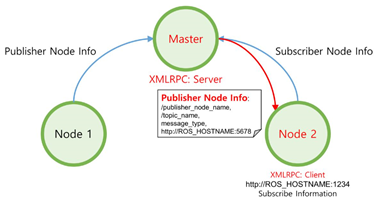
   
5. Yêu cầu kết nối từ Node Subscriber

 node subscriber yêu cầu một kết nối trực tiếp đến node publisher dựa trên thông tin subscriber nhận được từ các master. 
 Trong thủ tục yêu cầu, node subscriber truyền thông tin đến node publisher như 
 tên node subscriber, tên topic, và các message. node publisher và các node subscriber sử dụng XmlRpc.
 
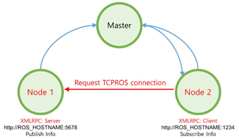

6. Kết nối Phản hồi từ Node Publisher

 Node publisher gửi các địa chỉ URI và số cổng của server TCP của nó để đáp ứng với yêu cầu kết nối từ node subscriber. Nút nhà xuất bản và các nút giao thuê bao sử dụng XmlRpc.
 
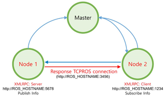
   
7. kết nối TCPROS

 Node subscriber tạo ra một client cho các node publisher sử dụng TCPROS, và kết nối đến node publisher. 
 Tại thời điểm này, thông tin liên lạc giữa các nút sử dụng giao thức TCP / IP dựa trên giao thức gọi là TCPROS.
 
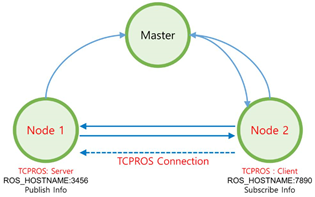
   
8. Truyền tin

 node publisher phát đi một message được xác định trước đến node subscriber. Các thông tin liên lạc giữa các nút sử dụng TCPROS.
   
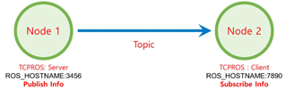

Service Request and Response
----------------------------

Thủ tục thảo luận ở trên tương ứng với các thông tin liên lạc là Topic. Thông tin liên lạc  topic publish và subscribe các message liên tục, 
trừ trường hợp publisher hoặc subscriber bị chấm dứt.

Dịch vụ thì có 2 loại hình thức
* Service Client: Request service and receive response
* Service Server: Receive a service, execute the specified task, and return a response

Kết nối giữa service server and client cũng giống như kết nối TCPROS cho publisher and subscriber được mô tả ở trên. 
Khác với topic, các service chấm dứt kết nối sau khi request và response thành công. 
Nếu yêu cầu bổ sung là cần thiết, các thủ tục liên quan phải được thực hiện một lần nữa.

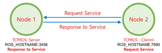
   

Action
------

   
Bạn nghĩ nó giống service nhưng thực chất nó giống topic hơn. nếu bạn dùng lệnh runtopic nó sẽ liệt kê ra 5 topic trong đó gồm có: mục tiêu, 
trạng thái, hủy bỏ, kết quả, và phản hồi được sử dụng trong action. Kết nối TCPROS cũng tương tự chỉ khác là khi client gửi lệnh hủy bỏ hoặc server gửi kết quả
thì sẽ ngắt kết nối.

Ví dụ về truyền thông tinw

 

   
   
   
   
   
   
   
   
   
   
   
   
   
   
   
   
   

